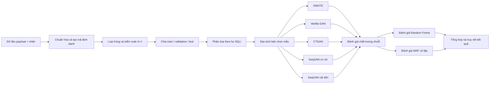
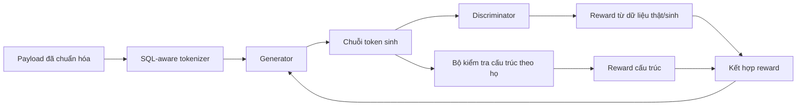

# GAN sinh dữ liệu SQL Injection cho mô hình phát hiện học máy

> **Tên đề tài:** Nghiên cứu mô hình GAN cho sinh dữ liệu tấn công SQL Injection nhằm nâng cao mô hình phát hiện dựa trên học máy  
> **Tác giả:** Phạm Đỗ Anh Minh  
> **Phạm vi:** nghiên cứu phòng thủ, thực nghiệm trong môi trường cô lập

Repository này tập hợp mã nguồn, cấu hình, dữ liệu đã chuẩn bị, nhật ký thực nghiệm và kết quả đánh giá cho năm phương pháp bổ sung dữ liệu SQL Injection:

- SMOTE;
- Vanilla GAN;
- CTGAN;
- SeqGAN cơ sở (`seqgan_master`);
- SeqGAN cải tiến (`seqgan_improved`).

Mục tiêu của nghiên cứu không chỉ là tạo nhiều chuỗi hơn. Một mẫu sinh ra chỉ có giá trị khi đồng thời được xem xét theo **tính mới**, **cấu trúc SQLi**, **dấu hiệu của họ tấn công**, **giá trị hỗ trợ mô hình phát hiện** và **phản ứng của WAF**.

## Mục lục

- [1. Câu hỏi nghiên cứu](#1-câu-hỏi-nghiên-cứu)
- [2. Kết quả chính](#2-kết-quả-chính)
- [3. Giới hạn diễn giải](#3-giới-hạn-diễn-giải)
- [4. Quy trình nghiên cứu](#4-quy-trình-nghiên-cứu)
- [5. Bốn họ SQL Injection](#5-bốn-họ-sql-injection)
- [6. Năm phương pháp được so sánh](#6-năm-phương-pháp-được-so-sánh)
- [7. SeqGAN cơ sở và SeqGAN cải tiến](#7-seqgan-cơ-sở-và-seqgan-cải-tiến)
- [8. Thiết kế thực nghiệm](#8-thiết-kế-thực-nghiệm)
- [9. Kết quả WAF](#9-kết-quả-waf)
- [10. Trạng thái bằng chứng](#10-trạng-thái-bằng-chứng)
- [11. Cấu trúc repository](#11-cấu-trúc-repository)
- [12. Bắt đầu sử dụng](#12-bắt-đầu-sử-dụng)
- [13. Tái lập và truy vết kết quả](#13-tái-lập-và-truy-vết-kết-quả)
- [14. An toàn và sử dụng có trách nhiệm](#14-an-toàn-và-sử-dụng-có-trách-nhiệm)
- [15. Trích dẫn](#15-trích-dẫn)

---

## 1. Câu hỏi nghiên cứu

Nghiên cứu tập trung vào bốn câu hỏi:

1. Việc tổ chức dữ liệu riêng theo từng họ SQL Injection có giúp giảm hiện tượng trộn các dấu hiệu cấu trúc không tương thích hay không?
2. Các phương pháp sinh trong không gian đặc trưng và truy hồi payload khác gì so với mô hình sinh trực tiếp chuỗi token?
3. Tokenizer nhận biết SQL, tăng huấn luyện trước, mở rộng độ dài chuỗi và phần thưởng cấu trúc ảnh hưởng thế nào đến SeqGAN?
4. Dữ liệu sinh có duy trì cấu trúc, hỗ trợ Random Forest và tạo phản ứng WAF có ý nghĩa hay chỉ tạo ra chuỗi nhiễu không khớp luật?

## 2. Kết quả chính

Toàn bộ nghiên cứu được tổng hợp từ **489 lượt chạy**, tạo hoặc truy hồi **413.700 payload** và thực hiện **825.899 yêu cầu HTTP đủ điều kiện** trong chiến dịch WAF đầy đủ.

### 2.1. SeqGAN cải tiến

| Chỉ số | Tỷ lệ 1:100 | Tỷ lệ 1:200 | Tỷ lệ 1:500 |
|---|---:|---:|---:|
| Tỷ lệ bảo toàn cấu trúc trung bình | 80,8% | **86,5%** | 79,0% |
| Mức tăng Recall lớp tấn công của Random Forest | +6,7 điểm % | +8,1 điểm % | **+11,1 điểm %** |

Các số liệu trên cho thấy cấu hình 1:200 đạt mức cân bằng tốt hơn về cấu trúc, trong khi dữ liệu bổ sung ở mức mất cân bằng cao hơn có thể tạo mức tăng Recall lớn hơn. Không nên diễn giải một chỉ số riêng lẻ là bằng chứng mô hình “tốt nhất” trong mọi điều kiện.

### 2.2. Phát hiện quan trọng về WAF

Trên 489 lượt chạy, tỷ lệ chuỗi mất cấu trúc có tương quan dương xấp xỉ **+0,88** với tỷ lệ yêu cầu không bị WAF chặn.

Điều này có nghĩa là tỷ lệ “không bị chặn” cao có thể xuất hiện vì chuỗi đã mất dấu hiệu SQLi, chứ không nhất thiết vì mô hình tạo được payload né luật có chất lượng. Vì vậy, kết quả WAF luôn phải được đọc cùng chỉ số cấu trúc và dấu hiệu họ tấn công.

## 3. Giới hạn diễn giải

Repository áp dụng các giới hạn tuyên bố sau:

- HTTP `200` chỉ được gọi là **không bị WAF chặn**; không được gọi là khai thác thành công.
- Backend thử nghiệm là dịch vụ phản hồi cục bộ, không thực thi payload trên hệ quản trị cơ sở dữ liệu.
- SMOTE, Vanilla GAN và CTGAN không trực tiếp sinh chuỗi SQL mới ở đầu ra cuối; chúng sinh trong không gian đặc trưng rồi truy hồi payload thật gần nhất trong tập huấn luyện cùng họ.
- Các kết quả chính hiện được tái lập theo seed cố định `88`. Độ ổn định qua nhiều seed độc lập và báo cáo `mean ± std` chưa được hoàn tất.
- Nghiên cứu chưa tuyên bố state of the art.
- Ablation đầy đủ cho từng thành phần cải tiến vẫn là phần cần bổ sung.

## 4. Quy trình nghiên cứu



Khung đánh giá không dùng một chỉ số duy nhất. Mỗi lượt chạy được xem xét theo:

- tỷ lệ cấu trúc hợp lệ;
- dấu hiệu đúng họ tấn công;
- tính duy nhất và mức trùng dữ liệu đầu vào;
- mức độ sụp đổ phân bố;
- tác động lên Recall của Random Forest;
- tỷ lệ bị chặn hoặc không bị chặn bởi WAF.

## 5. Bốn họ SQL Injection

Các chuỗi tấn công được tổ chức theo bốn họ trọng tâm để tránh trộn các dấu hiệu không tương thích.

| Họ | Dấu hiệu cấu trúc chính | Yêu cầu cần bảo toàn khi sinh |
|---|---|---|
| Boolean-based | `AND`/`OR`, phép so sánh, hằng, dấu nháy, chú thích | Quan hệ giữa toán tử logic, toán hạng và phần kết thúc truy vấn |
| Union-based | `UNION SELECT`, danh sách cột, `NULL` hoặc hằng | Cụm từ khóa, số lượng thành phần và vị trí thoát ngữ cảnh |
| Time-based | Hàm tạo trễ, đối số thời gian, điều kiện đi kèm | Tên hàm, đối số và quan hệ giữa điều kiện với hành vi tạo trễ |
| Error-based | Hàm gây lỗi, ép kiểu hoặc phép toán tạo ngoại lệ | Lời gọi hàm, đối số và ngữ cảnh có khả năng phát sinh lỗi |

### Ví dụ cú pháp minh họa

> Các chuỗi dưới đây chỉ minh họa dấu hiệu của từng họ. Chúng **không phải đầu ra được trích từ lượt chạy của repository** và không được dùng làm bằng chứng thực nghiệm.

```text
Boolean-based : ' OR 1=1 --
Union-based   : ' UNION SELECT NULL, NULL --
Time-based    : ' OR SLEEP(5) --
Error-based   : ' AND EXTRACTVALUE(1, CONCAT(0x7e, VERSION())) --
```

### Minh họa logic chuẩn hóa

```text
Trước:  '  Or   001 = 1  --
Sau:    ' or <NUM> = <NUM> --
```

Ví dụ trên chỉ mô tả mục tiêu giảm biến thể chữ hoa–chữ thường, khoảng trắng và giá trị số tương đương. Token chính xác phải được kiểm tra theo mã chuẩn hóa và schema dữ liệu của repository.

## 6. Năm phương pháp được so sánh

| Phương pháp | Không gian sinh | Đầu ra cuối cùng | Ý nghĩa khi đọc kết quả |
|---|---|---|---|
| SMOTE | Véc-tơ đặc trưng | Payload thật được truy hồi trong cùng họ | Bảo toàn chuỗi có sẵn; không chứng minh sinh chuỗi mới |
| Vanilla GAN | Véc-tơ đặc trưng | Payload thật được truy hồi trong cùng họ | Học phân bố đặc trưng, sau đó ánh xạ về dữ liệu thật |
| CTGAN | Hàng dữ liệu dạng bảng | Payload thật được truy hồi trong cùng họ | Phù hợp dữ liệu bảng; không trực tiếp mô hình hóa toàn chuỗi |
| SeqGAN cơ sở | Chuỗi token rời rạc | Chuỗi được sinh trực tiếp | Có khả năng tạo chuỗi mới nhưng dễ suy giảm cấu trúc và mode collapse |
| SeqGAN cải tiến | Chuỗi token nhận biết SQL | Chuỗi được sinh trực tiếp | Hướng tới cân bằng tính mới, cấu trúc và giá trị sử dụng |

Quy ước thuật ngữ và ánh xạ giữa tên khoa học với tên kỹ thuật được mô tả tại:

- [`docs/TERMINOLOGY_VI.md`](docs/TERMINOLOGY_VI.md)
- [`docs/METHOD_IMPLEMENTATION_MAP.md`](docs/METHOD_IMPLEMENTATION_MAP.md)

## 7. SeqGAN cơ sở và SeqGAN cải tiến

### 7.1. Khác biệt cấu hình

| Thành phần | SeqGAN cơ sở | SeqGAN cải tiến |
|---|---|---|
| Tokenizer | Theo ký tự | Nhận biết thành phần SQL |
| Huấn luyện trước Generator | 120 vòng trong cấu hình đầy đủ | 160 vòng trong cấu hình đầy đủ |
| Độ dài tối đa | 20 đơn vị chuỗi | 160 đơn vị chuỗi |
| Phần thưởng | Chủ yếu từ Discriminator | Kết hợp Discriminator và điểm cấu trúc theo họ |
| Mục tiêu | Sinh chuỗi giống dữ liệu thật | Sinh chuỗi vừa giống dữ liệu, vừa duy trì cấu trúc SQLi |

Cường độ của Discriminator được thảo luận trong thiết kế nhưng chưa được đánh giá như một biến độc lập. Vì vậy, kết quả không được quy riêng cho thành phần này.

### 7.2. Luồng huấn luyện khái quát



Trong cấu hình được khảo sát, trọng số thành phần cấu trúc ở khoảng `0,3`. Giá trị này cần được hiểu là siêu tham số thực nghiệm, không phải hằng số tối ưu cho mọi tập dữ liệu.

### 7.3. Bằng chứng payload thực tế

Phiên bản README này chưa đưa một cặp output thật từ `seqgan_master` và `seqgan_improved` vào phần chính vì chưa hoàn tất bước trích xuất có truy vết theo `run_key`, dòng dữ liệu và hash. Không nên gõ tay hoặc chọn một payload đẹp rồi trình bày như bằng chứng đại diện.

Một payload được công bố làm bằng chứng cần kèm tối thiểu:

- `run_key`, phương pháp, họ, tỷ lệ và seed;
- tệp nguồn và số dòng;
- SHA-256 của chuỗi;
- payload gốc và payload sau chuẩn hóa;
- kết quả cấu trúc, dấu hiệu họ và trùng dữ liệu đầu vào;
- kết quả GET/POST trong chiến dịch WAF;
- giải thích vì sao mẫu đạt hoặc không đạt.

Các manifest truy vết hiện có:

- [`final_result_info/_index/thesis_table_manifest.csv`](final_result_info/_index/thesis_table_manifest.csv)
- [`final_result_info/_index/thesis_run_traceability.csv`](final_result_info/_index/thesis_run_traceability.csv)

## 8. Thiết kế thực nghiệm

Lịch sử thực nghiệm được chia theo nhiều mức ngân sách. Kết quả Smoke, Mini và Medium chỉ dùng để kiểm tra mã, dữ liệu và hành vi huấn luyện; chúng không thay thế kết quả cấu hình đầy đủ.

| Profile | Số mẫu sinh | Ngân sách huấn luyện chính |
|---|---:|---|
| Smoke | 64 | GAN 2 epoch; CTGAN 2; SeqGAN G-pretrain 1, adversarial tối đa 1, rollout 2 |
| Mini | 200 | GAN 15; CTGAN 25; SeqGAN G-pretrain 15, adversarial tối đa 6, rollout 3 |
| Medium SeqGAN | 500 | G-pretrain 60/80; D-pretrain `30 × 3`; adversarial tối đa 60; rollout 8 |
| Full | 2.000 | GAN 100; CTGAN 300; SeqGAN G-pretrain 120/160; D-pretrain `50 × 3`; adversarial tối đa 200; rollout 16 |
| B6X resume | 2.000 | Lịch Full; batch 384; checkpoint mỗi 10 epoch; hỗ trợ chạy tiếp |

### Early stopping của SeqGAN cải tiến

`seqgan_improved` theo dõi `discriminator_reward_mean`. Mặc định, lượt chạy dừng sau ba epoch đối kháng liên tiếp có reward dưới `0.05` và ghi `stop_reason=vanishing_reward`.

Do đó, khi kiểm toán một lượt chạy phải đọc đồng thời:

- `planned_epochs`;
- `actual_epochs`;
- `stop_reason`;
- `training_metadata.json`;
- `logs/epoch_metrics.csv`.

Tên checkpoint riêng lẻ không đủ để kết luận lượt chạy đã thiếu epoch hay chưa.

## 9. Kết quả WAF

Chiến dịch đầy đủ sử dụng ModSecurity và OWASP Core Rule Set trong Docker cô lập.

| Kết quả | Số lượng | Tỷ lệ trên yêu cầu đủ điều kiện |
|---|---:|---:|
| Payload được sinh hoặc truy hồi | 413.700 | — |
| GET + POST dự kiến | 827.400 | — |
| Yêu cầu thực sự được gửi | 825.899 | 100% |
| GET không gửi vì URL mã hóa quá dài | 1.501 | Loại khỏi mẫu số |
| Bị WAF chặn | 585.661 | 70,91% |
| Không bị WAF chặn | 240.238 | 29,09% |

Nguồn tổng hợp chính:

- [`waf_evaluation/waf_evaluation/campaign/full/waf_summary.json`](waf_evaluation/waf_evaluation/campaign/full/waf_summary.json)
- [`docs/RESULT_SCHEMA.md`](docs/RESULT_SCHEMA.md)
- [`docs/EXPERIMENT_PROVENANCE.md`](docs/EXPERIMENT_PROVENANCE.md)

### Cách đọc đúng chỉ số WAF

Ba đại lượng cần được tách riêng:

1. tỷ lệ chuỗi có cấu trúc hợp lệ;
2. tỷ lệ yêu cầu bị chặn hoặc không bị chặn;
3. tỷ lệ payload **vừa hợp lệ vừa không bị chặn**.

Đại lượng thứ ba phải được tính bằng cách join kết quả chất lượng và kết quả WAF ở cấp payload. Không được ước lượng bằng cách nhân hai tỷ lệ tổng hợp vì hai biến không độc lập.

## 10. Trạng thái bằng chứng

| Hạng mục | Trạng thái hiện tại | Cách diễn giải an toàn |
|---|---|---|
| Kết quả tổng hợp 489 lượt chạy | Có | Có thể dùng để mô tả quy mô và xu hướng |
| Cấu trúc, Random Forest và WAF | Có bảng tổng hợp | Phải đọc đồng thời, không tách WAF khỏi chất lượng chuỗi |
| Payload minh họa theo bốn họ | Mới có ví dụ cú pháp minh họa | Chưa phải bằng chứng từ artifact thực nghiệm |
| Cặp SeqGAN cơ sở–cải tiến có truy vết | Chưa đưa vào README chính | Không được tự tạo hoặc chọn thủ công thiếu manifest |
| Nhiều seed độc lập | Chưa hoàn tất | Kết quả hiện tại là single-seed evidence tại seed 88 |
| `mean ± std` | Chưa có | Không tuyên bố độ ổn định theo khởi tạo ngẫu nhiên |
| Ablation từng cải tiến | Chưa đầy đủ | Chưa quy kết chính xác mức đóng góp riêng của từng thành phần |
| Giao `hợp lệ ∩ không bị chặn` ở cấp payload | Cần bổ sung bảng công khai | Không dùng phép nhân hai tỷ lệ tổng hợp |

## 11. Cấu trúc repository

```text
GAN_Final/
├── common/                         # Thành phần dùng chung
├── configs/                        # Cấu hình thực nghiệm
├── data/prepared/                  # Dữ liệu đã chuẩn bị
├── docker/                         # Môi trường WAF cô lập
├── docs/                           # Thuật ngữ, schema, provenance, truy vết
├── final_result_info/              # Chỉ mục kết quả phục vụ luận văn
├── models/                         # Triển khai các phương pháp/mô hình
├── reports/                        # Báo cáo được sinh từ kết quả
├── scripts/                        # Script tổng hợp, đánh giá và vận hành
├── tests/                          # Kiểm thử
├── waf_evaluation/waf_evaluation/  # Chiến dịch và kết quả WAF
├── COLAB_GUIDE.md                  # Hướng dẫn chạy trên Colab
├── GAN_SQLi_Colab.ipynb            # Notebook chính
├── requirements.txt                # Phụ thuộc Python
└── README.md
```

Tài liệu kỹ thuật quan trọng:

- [`docs/ORIGINAL_GAN_FOR_SQLi_README.md`](docs/ORIGINAL_GAN_FOR_SQLi_README.md): README chi tiết của cây mã nguồn gốc;
- [`docs/THESIS_CODE_TRACEABILITY.md`](docs/THESIS_CODE_TRACEABILITY.md): ánh xạ nội dung luận văn với mã nguồn;
- [`docs/RESULT_SCHEMA.md`](docs/RESULT_SCHEMA.md): schema kết quả và mẫu số chỉ số;
- [`docs/EXPERIMENT_PROVENANCE.md`](docs/EXPERIMENT_PROVENANCE.md): quy tắc truy vết thực nghiệm;
- [`COLAB_GUIDE.md`](COLAB_GUIDE.md): hướng dẫn thực thi;
- [`GAN_SQLi_Colab.ipynb`](GAN_SQLi_Colab.ipynb): notebook chạy trên Colab.

## 12. Bắt đầu sử dụng

### 12.1. Clone repository và lấy dữ liệu Git LFS

```bash
git clone https://github.com/MinhBe/GAN_Final.git
cd GAN_Final

git lfs install
git lfs pull
```

### 12.2. Tạo môi trường Python

```bash
python -m venv .venv
```

Linux/macOS:

```bash
source .venv/bin/activate
```

Windows PowerShell:

```powershell
.\.venv\Scripts\Activate.ps1
```

Cài phụ thuộc:

```bash
python -m pip install --upgrade pip
pip install -r requirements.txt
```

### 12.3. Chạy bằng Colab

Mở [`GAN_SQLi_Colab.ipynb`](GAN_SQLi_Colab.ipynb) và thực hiện theo [`COLAB_GUIDE.md`](COLAB_GUIDE.md).

### 12.4. Khởi động môi trường WAF cô lập

```bash
docker compose -p gan-final-waf -f docker/docker-compose.yml up -d --build
```

Không thay URL đích bằng hệ thống bên ngoài. Các script WAF chỉ được dùng với dịch vụ cục bộ hoặc môi trường được cấp phép rõ ràng.

## 13. Tái lập và truy vết kết quả

Trước khi dùng một con số trong bài viết hoặc slide, cần truy được chuỗi:

```text
nhận định
→ bảng luận văn
→ run_key
→ cấu hình
→ tệp kết quả
→ dòng dữ liệu
→ payload/hash
→ đánh giá cấu trúc
→ phản ứng WAF
```

Các tệp nên được kiểm tra trước:

- [`final_result_info/_index/thesis_table_manifest.csv`](final_result_info/_index/thesis_table_manifest.csv)
- [`final_result_info/_index/thesis_run_traceability.csv`](final_result_info/_index/thesis_run_traceability.csv)
- [`docs/THESIS_CODE_TRACEABILITY.md`](docs/THESIS_CODE_TRACEABILITY.md)
- [`docs/EXPERIMENT_PROVENANCE.md`](docs/EXPERIMENT_PROVENANCE.md)

Khi báo cáo một lượt chạy SeqGAN, tối thiểu phải ghi:

- commit SHA;
- hash dữ liệu;
- seed;
- họ SQLi, tỷ lệ và kịch bản chọn mẫu;
- cấu hình tokenizer, chiều dài, pretraining và reward;
- epoch dự kiến, epoch thực tế và lý do dừng;
- toàn bộ giá trị thô trước khi tính thống kê.

## 14. An toàn và sử dụng có trách nhiệm

Repository chỉ phục vụ:

- nghiên cứu phát hiện và phòng chống SQL Injection;
- đánh giá dữ liệu sinh trong môi trường kiểm soát;
- kiểm thử WAF cục bộ hoặc hệ thống có sự cho phép rõ ràng;
- nghiên cứu khả năng tái lập của mô hình sinh.

Không sử dụng mã nguồn hoặc payload để truy cập, thử nghiệm hoặc gây ảnh hưởng đến hệ thống không thuộc quyền sở hữu hay không có ủy quyền.

Repository hiện đã được công khai trên GitHub. Tuy nhiên, trạng thái giấy phép và quyền phân phối lại dataset/generated artifacts cần tiếp tục được kiểm tra tại [`LICENSE_STATUS.md`](LICENSE_STATUS.md). Không mặc định rằng mọi tệp dữ liệu đều có quyền tái phân phối chỉ vì chúng xuất hiện trong repository.

Xem thêm [`SECURITY.md`](SECURITY.md) trước khi báo cáo lỗ hổng hoặc thực hiện kiểm thử.

## 15. Trích dẫn

Khi sử dụng repository này trong công trình học thuật, có thể trích dẫn luận văn theo mẫu:

```bibtex
@mastersthesis{pham2026gan_sqli,
  author  = {Phạm Đỗ Anh Minh},
  title   = {Nghiên cứu mô hình GAN cho sinh dữ liệu tấn công SQL Injection nhằm nâng cao mô hình phát hiện dựa trên học máy},
  school  = {Học viện Kỹ thuật Mật mã},
  year    = {2026},
  type    = {Luận văn Thạc sĩ}
}
```

### Công trình nền tảng

- N. V. Chawla et al., **SMOTE: Synthetic Minority Over-sampling Technique**, 2002.
- I. Goodfellow et al., **Generative Adversarial Nets**, 2014.
- L. Yu et al., **SeqGAN: Sequence Generative Adversarial Nets with Policy Gradient**, 2017.
- L. Xu et al., **Modeling Tabular Data using Conditional GAN**, 2019.

---

## Tóm tắt một câu

**Đóng góp trọng tâm của repository là xây dựng một quy trình có thể truy vết để so sánh các phương pháp bổ sung dữ liệu SQL Injection, cải tiến SeqGAN theo cấu trúc SQL và chỉ ra rằng tỷ lệ không bị WAF chặn chỉ có ý nghĩa khi được đọc cùng chất lượng cấu trúc của payload.**
